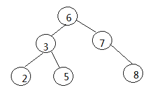
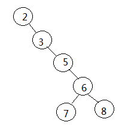

###二叉树
[二叉树](http://zh.wikipedia.org/wiki/%E4%BA%8C%E5%8F%89%E6%A0%91)是每个节点最多有两个子树的数结构  

###树的遍历
[树的遍历](http://zh.wikipedia.org/wiki/%E6%A0%91%E7%9A%84%E9%81%8D%E5%8E%86#.E4.B8.AD.E5.BA.8F.E9.81.8D.E5.8E.86)是通过一种方法按照一定的顺序访问一颗树的过程，二叉树的便利方式常见的有三种：先序遍历、中序遍历、后续遍历。  
**先序遍历**：首先访问根节点然后遍历左子树，最后遍历右子树。假单记作**根左右**，上图按照先序遍历为：6 3 2 5 7 8  
**中序遍历**：先遍历左子树，然后访问根节点，再遍历右子树。简单记住**左根右**，上图按照中序遍历的结果就是：2 3 5 6 7 8  
**后续遍历**：先遍历左子树，然后遍历右子树，最后遍历访问根节点，简单记住**左右根**，上图按照后续遍历的结果是：2 5 3 7 8 6  
从中可以看出一点规律是**前中后**都是相对于根节点而言的，然后左右顺序是不变的，变得只是根节点的位置。  
###二叉查找树
二叉查找树中，左子树的值总是小于根的值，右子树的值总是大于根的值，满足这样条件的二叉树就是二叉查找树，它又称为有序二叉树。上图就是一颗二叉查找树。  

对于上图中的二叉查找树，如果想查找值为7的节点，先从根节点找，6 > 7，然后往右子树查找，第二次就找到了，而如果按照从小到大的顺序找的话，要找5次才能找到。但是二叉查找树是可以有不同构建方式的，比如下图也是一个二叉查找树：  
  
然而对于这样的二叉查找树，它的查询效率就比较前面那种要低了，前面的平均查找时间为(1+2+2+3+3+3)/6=2.3，而后面那种二叉查找树的平均查找时间为：(1+2+3+4+5+5)/6=3.16，因此要想查询效率高效就要尽可能使得二叉查找树能均匀的分布，这就有了平衡二叉树。  

###平衡二叉树
平衡二叉树是在满足二叉查找树的条件下，任何节点的左右两个子树的高度差不能大于1，比如上图中，节点5的右子树高度是2，左子树没有，他们的高度差为2，显然就不满足平衡二叉树的条件。  

